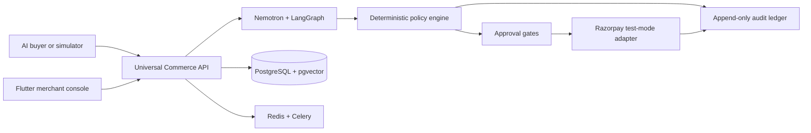

# Agentic Commerce Gateway

**ACG makes a merchant discoverable, negotiable, and transactable by AI buyers while keeping every money action explainable, bounded, and gated.**

[](backend/)
[](frontend/)
[](https://build.nvidia.com/nvidia/nemotron-3-ultra-550b-a55b)
[](https://razorpay.com/docs/payments/payment-gateway/)

ACG is a complete Flutter merchant console and FastAPI commerce gateway built for **Track 01 — AI Growth & Agentic Commerce**. It addresses the challenge of growing merchant revenue and making merchants sellable to AI buyers end to end on Razorpay test-mode APIs. The interface combines glassmorphism, soft neomorphic controls, and an accessible responsive layout. NVIDIA Nemotron 3 Ultra interprets buyer intent and explains outcomes; deterministic services retain authority over prices, discounts, inventory, approvals, and payments.

## The Track 01 problem

NPCI's UAP and the global protocol race around ACP, AP2, and x402 are making agent-to-agent commerce a defining interoperability problem. Merchants need more than a chatbot: they need an agent-readable catalog, bounded negotiation, checkout, payment verification, revenue attribution, and a durable audit trail.

ACG covers the example directions in the challenge through one connected workflow:

- **Conversational in-app checkout:** a buyer describes intent, compares offers, negotiates, accepts a quote, and completes Razorpay test checkout.
- **Agent-readable catalog:** structured discovery exposes normalized products, variants, inventory, commercial terms, compatibility, warranty, and readiness signals.
- **Upsell and cross-sell agent:** Nemotron proposes relevant alternatives and bundles while the policy engine enforces stock, discount, margin, and approval limits.
- **Campaign and growth orchestration:** the gateway measures verified revenue, incremental revenue, average order value, conversion, abandonment, and offer attribution.
- **Explainable and gated money actions:** every proposal records inputs, model or fallback path, policy evaluation, approval state, payment transition, and recovery event.
- **Graceful failure handling:** provider timeouts preserve uncertain attempts, duplicate requests remain idempotent, delayed webhooks can be reconciled, and invalid AI output falls back to deterministic interpretation.

## Architecture and technology stack



| Layer | Technology |
|---|---|
| Merchant experience | Flutter, Dart, Riverpod, GoRouter, Dio, FL Chart; responsive glassmorphism and neomorphism |
| API and domain services | Python 3.12, FastAPI, Pydantic, SQLAlchemy, Alembic |
| Agent orchestration | NVIDIA Nemotron 3 Ultra through NVIDIA NIM, NVIDIA embeddings, LangGraph, structured tool calls |
| Commerce controls | Deterministic pricing, margin and discount policies, expiring approvals, atomic reservations, idempotency |
| Payments | Razorpay test-mode Orders, Standard Checkout, HMAC callbacks and webhooks, capture verification, reconciliation |
| Data and jobs | PostgreSQL 16, pgvector, Redis, Celery; SQLite development profile |
| Delivery and quality | Docker Compose, GitHub Actions, pytest, Ruff, Flutter Analyze, Flutter widget tests |

## Run the app

The prepared local release is served at **http://127.0.0.1:8080** while the server is running. Choose **Explore a sample workspace** for an isolated development workspace with 100 electronics products, or create a merchant account. Revenue starts at zero and only increases after a verified captured payment.

From PowerShell in this directory:

```powershell
.\scripts\start.ps1
# Rebuild after changing Flutter code:
.\scripts\start.ps1 -Build
```

Prerequisites: Python 3.12 and Flutter 3.27.1 or a compatible newer release. The prepared `.venv` and web build are available locally and excluded from source control. The start script applies migrations and serves the API and Flutter app from the same origin. Stop it with Ctrl+C.

The application uses SQLite locally. PostgreSQL with pgvector and Redis/Celery are configured for container deployment. Financial reservations remain in the transactional database rather than Redis, so a cache outage cannot lose stock reservations.

## Connect NVIDIA Nemotron

Copy `.env.example` to `.env`, set `NVIDIA_API_KEY`, and restart the backend. The default model is:

```dotenv
NVIDIA_MODEL=nvidia/nemotron-3-ultra-550b-a55b
NVIDIA_BASE_URL=https://integrate.api.nvidia.com/v1
NVIDIA_EMBEDDING_MODEL=nvidia/nv-embedqa-e5-v5
```

Nemotron receives structured tool definitions and returns Pydantic-validated intent or explanation proposals. Only the allowlisted `submit_proposal` tool result is accepted. The AI layer cannot import or invoke the payment service. LangGraph coordinates interpretation, deterministic filtering, ranking, and growth evaluation; persistent financial state lives outside the graph.

When the key is missing, the provider times out, or output validation fails, the response explicitly reports local fallback. This uses synonym-aware vectors and deterministic interpretation, not a simulated NVIDIA response. NVIDIA embeddings use a separate embedding model because a generative chat model does not provide the required embedding endpoint. PostgreSQL uses pgvector cosine distance; local SQLite uses the same vectors with in-process scoring.

Documentation: [NVIDIA Nemotron 3 Ultra model reference](https://docs.api.nvidia.com/nim/reference/nvidia-nemotron-3-ultra-550b-a55b).

## Connect Razorpay test checkout

1. Sign in as a workspace owner and open **Integrations**.
2. Save a Razorpay **test** Key ID, Key Secret, and a webhook secret of at least 16 characters. Production keys are rejected.
3. In Razorpay Test Dashboard, configure the webhook path displayed in Integrations, using your public HTTPS backend origin. Subscribe to `payment.captured` and `payment.failed`. Localhost needs a tunnel to receive provider webhooks.
4. Use Buyer Simulator → negotiate → approve if required → **Accept & checkout**. Razorpay's actual test checkout opens once a server-created provider order exists.
5. The backend checks the callback HMAC, fetches the payment, and validates capture status, amount, currency, and provider order before confirming the merchant order.

Workspace credentials are encrypted with Fernet in the database. Only the public test Key ID is supplied to Razorpay Checkout. Secret keys and webhook secrets never appear in client responses, saved source, audit payloads, or model context. Back up the encryption key together with the database; losing it makes saved workspace credentials unreadable.

A callback reporting success cannot mark an authorized-but-uncaptured payment as paid. Use **Transactions → Reconcile status** when a webhook is delayed. If order creation times out, the app deliberately preserves the uncertain attempt and refuses to issue another create-order call for that quote. Use **Recover provider reference** with the Razorpay order whose receipt matches the internal order ID. The backend verifies that association before proceeding.

Documentation: [Razorpay Standard Checkout integration](https://razorpay.com/docs/payments/payment-gateway/web-integration/standard/integration-steps/).

## Merchant workflows

| Area | Implemented behavior |
|---|---|
| Authentication | Argon2 password hashing; expiring signed sessions; merchant isolation; owner/operator/viewer enforcement |
| Catalog | CSV/JSON imports up to 5 MB/10,000 rows; common Shopify/WooCommerce field aliases; row errors; duplicate preservation; editing; stock, cost, compatibility, returns, warranty and variant metadata |
| Readiness | Ten weighted components, explainable deductions and linked remediation; real catalog/configuration data |
| Discovery | Natural-language and structured intent; session memory; stock, budget, category, required attributes and delivery filters; semantic ranking and rejection explanations |
| Growth | Compatible cross-sells, higher-value alternatives and bundles; policy-checked proposals ranked by expected revenue; versioned heuristic conversion estimates |
| Negotiation | Persisted rounds; automatic and absolute discount limits; strict margin floor; final permissible counteroffer; abandonment-triggered rescue; strategic bulk detection |
| Approvals | Mobile economics cards; approve, reject and custom total; approver/reason/expiry; quote-specific override without changing global policy |
| Policy | Versioned rules; SKU → product → category → merchant precedence; discount, margin, amount, inventory, bundle, delivery, bulk and rescue controls |
| Transactions | Expiring reserved quotes; atomic stock checks; price/policy revalidation; idempotent checkout; signed and deduplicated webhooks; capture verification; controlled retry and reconciliation |
| Analytics | Verified revenue, AOV, conversion, bulk revenue, discount/round metrics, rejection reasons, date/category filters, and order-level attribution |
| Audit | Merchant-scoped append-only database ledger; state changes, model/fallback, inputs, policy, approvals, payments and recovery timeline |
| Integration boundary | Versioned universal commerce API and OpenAPI; payment provider protocol; ACP/AP2/MCP/x402 explicitly advertised as future adapters |

All API money fields are **integer INR paise**. CSV/JSON file imports default to **rupees**; use `?currency_unit=paise` when importing paise. This distinction prevents a 100× price error. The sample catalog is in `examples/electronics-100.csv`.

## API and code layout

Interactive API documentation: **http://127.0.0.1:8080/docs**. Capability discovery is public at `/api/v1/commerce/capabilities`. Other endpoints require `Authorization: Bearer <access_token>` obtained from registration or login. Treat merchant session tokens as privileged; do not embed them in publicly shipped external clients. Dedicated limited-scope external buyer credentials are a production hardening item.

Core endpoints follow the SRS: `/commerce/discover`, `/commerce/recommend`, `/commerce/negotiate`, `/commerce/quote`, `/commerce/checkout`, `/orders/{id}`, `/catalog/*`, `/policies`, `/approvals`, `/transactions`, `/analytics/*`, and `/audit`, all under `/api/v1`.

```text
backend/app/
  auth.py          Merchant authentication and encrypted credential handling
  catalog.py       Import normalization, product data and readiness
  agents.py        Nemotron, embeddings, LangGraph and growth proposals
  policies.py      Pure deterministic economics and policy evaluation
  commerce.py      Negotiation, approval, quoting and reservations
  payments.py      Razorpay adapter, state machine, verification and recovery
  analytics.py     Attribution and aggregate metrics
  jobs.py          Durable catalog jobs and scheduled assurance
  db.py            Workspace/product tables and versioned domain records
  schemas.py       Validated universal request and policy contracts
  main.py          API route composition and authenticated WebSocket events
backend/migrations/  Alembic migrations and immutable audit protections
frontend/lib/
  core/            API client, theme, responsive shell and checkout bridge
  features/        Authentication and all merchant screens
```

Domain records use a workspace/kind-scoped JSON aggregate store for the MVP. Unique keys and a merchant row lock serialize financial operations in PostgreSQL; SQLite uses `BEGIN IMMEDIATE`. Quotes snapshot current prices and policy context. A unique quote-to-order mapping prevents duplicate checkout even if callers change their idempotency key. The payment engine persists an attempt before calling Razorpay. Captured orders decrement inventory and record attribution once.

AI incremental revenue = final captured revenue − baseline cart value = upsell + cross-sell − discount. Growth attribution labels are accepted only when they match a server-issued offer. All conversion estimates are heuristics, not claims about a trained model's accuracy.

## Deploy with PostgreSQL and Redis

Docker is not installed in the provided workspace, so this container configuration has not been executed here.

```powershell
.\.venv\Scripts\python.exe scripts\generate-secrets.py
# Edit .env.production: NVIDIA_API_KEY and your HTTPS ALLOWED_ORIGINS.
docker compose --env-file .env.production up --build -d
```

The image builds Flutter and serves the result with FastAPI. Compose includes pgvector/PostgreSQL 16, Redis, a Celery worker, and a scheduler. The API is bound to loopback port 8000; place an HTTPS reverse proxy in front of it for remote access. Development demo account creation is disabled in production. Razorpay credentials must be configured per workspace in production. Never publish `.env`, `.env.production`, `.local`, database files, or build-time tokens.

Alembic runs before the API starts. The scheduler reconciles pending payments, releases eligible expired reservations, clears expired conversation memory, and recovers queued enrichment work. In local mode, import jobs run after the response and payment reconciliation is available on demand; Redis is not required.

The Sites hosting runtime available in this session supports Cloudflare Worker/static deployments, which cannot directly host this Python/PostgreSQL stack. No incomplete public frontend deployment was created. Use a container host for the supplied deployment or point a separately hosted Flutter build at your HTTPS API via `--dart-define=API_BASE_URL=...`.

## Verification and remaining acceptance gates

```powershell
.\.venv\Scripts\python.exe -m pytest -q
.\.venv\Scripts\python.exe -m ruff check backend
cd frontend
flutter analyze
flutter test
flutter build web --release --pwa-strategy=none
```

Locally verified: 29 backend tests; 4 Flutter interaction tests; clean Flutter static analysis; a successful Flutter release build; and a real HTTP smoke flow covering signup, 100 products, constrained discovery, negotiation, stock reservation, and audit recording. Tests cover all five SRS failure classes, tenant/role boundaries, concurrent reservations, discount and margin boundaries, override expiry, rescue/round limits, capture mismatches, duplicate/out-of-order webhooks, and exact attribution. Provider behavior is mocked in automated tests; no live NVIDIA call or actual Razorpay test payment has been executed without credentials.

Remaining deployment acceptance gates are real Nemotron responses/tool-call compatibility for the configured account, real Razorpay test checkout plus public webhook delivery, PostgreSQL/Redis worker execution, HTTPS configuration, and operational load/availability testing. The SRS's p95/uptime targets and full WCAG conformance are targets, not measured certifications. Browser end-to-end automation was not run; the frontend checks are Flutter widget tests. External API access currently uses merchant session authorization, the local rate limiter is per process, and enterprise identity/retention controls require deployment hardening. Native Android/iOS packaging and real-money settlement remain outside the requested MVP scope.

GitHub Actions runs backend tests, static analysis, Flutter tests, and the production web build for every proposed change.

Companion visual direction: [Figma design board](https://www.figma.com/design/u14gKySEC5Vo690pFN8W8L).
